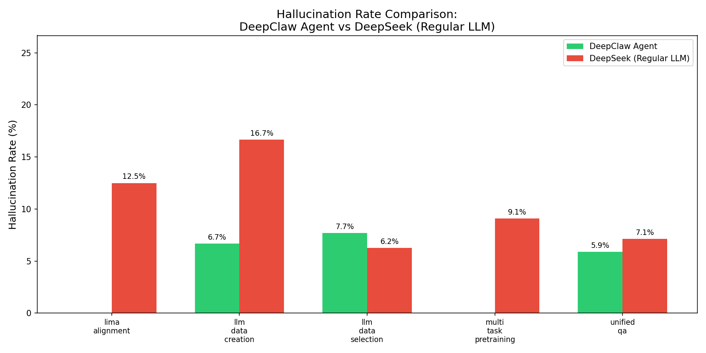
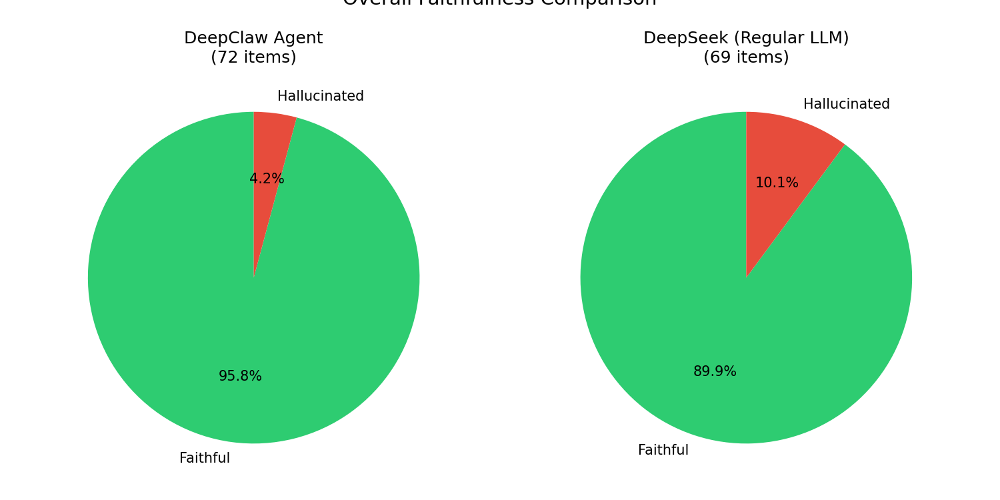

# 幻觉率对比示例数据

本目录包含 5 篇论文的幻觉率对比数据，用于验证 DeepClaw Agent 证据协议的有效性。

## 目录结构

```
example_contrast/
├── README.md                          # 本文件
├── hallucination_check.py            # 批量分析脚本
├── hallucination_visualize.py        # 可视化脚本
├── hallucination_comparison.png      # 各项目幻觉率对比柱状图
├── hallucination_overall.png         # 整体幻觉率对比饼图
│
├── lima-alignment/                   # 论文1: LIMA: Less Is More for Alignment
│   ├── paper/                        # 论文 PDF
│   ├── evidence.json                 # DeepClaw Agent 证据
│   ├── deepseek_evidence.json       # DeepSeek（普通大模型）证据
│   └── deepseek_report.md            # DeepSeek 分析报告
│
├── llm-data-creation/                # 论文2: LLM 作为数据创造器
│   ├── paper/
│   ├── evidence.json
│   ├── deepseek_evidence.json
│   └── deepseek_report.md
│
├── llm-data-selection/                # 论文3: 基于学习百分比选择训练数据
│   ├── paper/
│   ├── evidence.json
│   ├── deepseek_evidence.json
│   └── deepseek_report.md
│
├── multi-task-pretraining/            # 论文4: MUPPET 多任务预训练
│   ├── paper/
│   ├── evidence.json
│   ├── deepseek_evidence.json
│   └── deepseek_report.md
│
└── unified-qa/                      # 论文5: UNIFIEDQA 统一问答模型
    ├── paper/
    ├── evidence.json
    ├── deepseek_evidence.json
    └── deepseek_report.md
```

## 数据说明

### evidence.json
DeepClaw Agent 生成的证据文件，包含：
- `original_text`: 原文逐字引用
- `claim_text`: AI 生成的声明
- `audit_result`: 审计结果（faithful/drifted/unsupported）

### deepseek_evidence.json
普通大模型（DeepSeek）直接阅读论文后生成的证据文件，无证据链约束。
- `audit_result`: 审计结果（faithful/drifted/unsupported），由 **deepseek** 大模型审计判定
- `auditor`: 审计员名称（deepseek）
- `audit_method`: 审计方法（llm-judge）

## 脚本使用

### LLM 审计脚本（llm_audit.py）

使用 DeepSeek 大模型批量审计 `deepseek_evidence.json` 文件中的 claim 忠实度。

**前置条件：**
```bash
export DEEPSEEK_API_KEY=your_api_key
```

**基本用法：**
```bash
# 审计所有论文文件夹
python scripts/llm_audit.py --base-dir example_contrast

# 干跑模式（不调用API，只显示待审计项）
python scripts/llm_audit.py --base-dir example_contrast --dry-run

# 指定特定文件夹
python scripts/llm_audit.py --base-dir example_contrast/lima-alignment

# 自定义审计员名称
python scripts/llm_audit.py --base-dir example_contrast --auditor deepseek-v4
```

**审计结果判定标准：**

| 判定 | 含义 | 判断依据 |
|------|------|---------|
| faithful（忠实） | claim 与 original_text 语义完全一致 | 逐字引用准确 |
| drifted（偏移） | claim 与 original_text 语义有偏差 | 省略关键词、扩大/缩小范围 |
| unsupported（无根据） | claim 无法从 original_text 验证 | 无对应原文或超出范围 |

**输出示例：**
```
Found 5 evidence files:
  - example_contrast/lima-alignment/deepseek_evidence.json
  - example_contrast/llm-data-creation/deepseek_evidence.json
  ...

Auditing: example_contrast/lima-alignment/deepseek_evidence.json
  Found 16 evidence items
  Auditing EV-001...-> faithful
  Auditing EV-005...-> drifted
  ...

  Summary:
    faithful:     14
    drifted:      2
    unsupported:  0
  Hallucination rate: 12.50%
```

### 幻觉率分析脚本（hallucination_check.py）

批量分析并统计幻觉率。

```bash
cd example_contrast
python hallucination_check.py
```

### 可视化脚本（hallucination_visualize.py）

生成对比柱状图和饼图。

```bash
python hallucination_visualize.py
```

## 运行方法

### 批量分析（在 example_contrast 根目录运行）
```bash
cd example_contrast
python hallucination_check.py
```

### 生成可视化图表
```bash
python hallucination_visualize.py
```

## 幻觉率计算

```
幻觉率 = (drifted + unsupported) / 已审计证据数
```

| 类型 | 说明 |
|------|------|
| faithful | 声明忠实于原文 |
| fixed | 原为漂移，已修复 |
| drifted | 部分幻觉（扩大范围/夸大） |
| unsupported | 完全幻觉（无原文支撑） |

---

## 对比结果

### 各项目幻觉率对比

| 项目 | DeepClaw Agent | DeepSeek (Regular LLM) | 差异 |
|------|---------------|------------------------|------|
| lima-alignment | 0.00% | 12.50% | **-12.50%** |
| llm-data-creation | 6.67% | 16.67% | **-10.00%** |
| llm-data-selection | 7.69% | 6.25% | +1.44% |
| multi-task-pretraining | 0.00% | 9.09% | **-9.09%** |
| unified-qa | 5.88% | 7.14% | **-1.26%** |
| **整体** | **4.17%** | **10.14%** | **-5.98%** |

### 整体统计

| 模型 | 总证据数 | 已审计 | 漂移 | 无据 | 幻觉率 |
|------|---------|--------|------|------|--------|
| DeepClaw Agent | 77 | 72 | 3 | 0 | **4.17%** |
| DeepSeek (Regular LLM) | 69 | 69 | 6 | 1 | **10.14%** |

**整体幻觉率差异: +5.98%**
→ **DeepClaw Agent 整体幻觉率降低了 58.93%**

### 可视化图表

#### 1. 各项目幻觉率对比柱状图


#### 2. 整体幻觉率对比饼图


---

## 结论

1. **DeepClaw Agent 在 5 个项目中的 4 个项目上幻觉率低于 DeepSeek**
   - lima-alignment: 0.00% vs 12.50% (-12.50%)
   - llm-data-creation: 6.67% vs 16.67% (-10.00%)
   - multi-task-pretraining: 0.00% vs 9.09% (-9.09%)
   - unified-qa: 5.88% vs 7.14% (-1.26%)

2. **DeepClaw Agent 整体幻觉率为 4.17%，比 DeepSeek (10.14%) 降低了 58.93%**

3. **证据链协议的有效性得到验证**：DeepClaw Agent 通过证据链约束，显著降低了幻觉率

---

